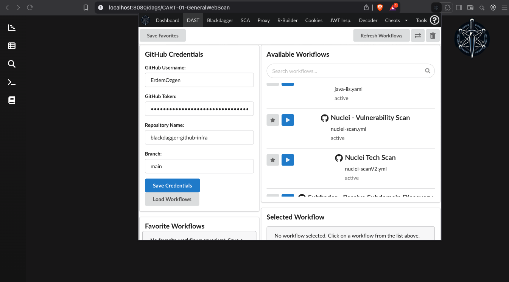
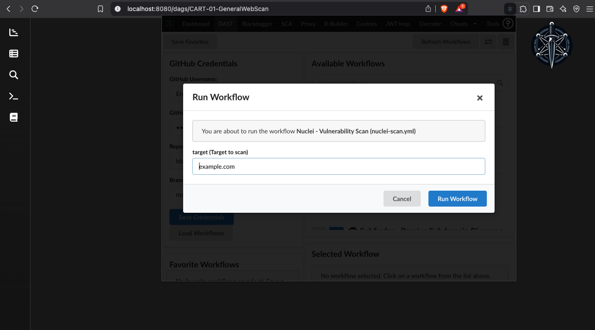
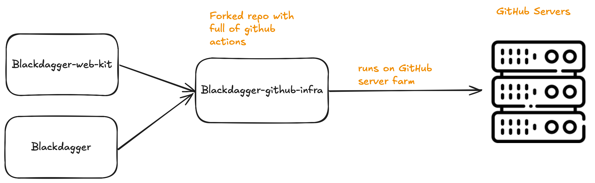

# BlackDagger GitHub Infra 

  

## Introduction

BlackDagger GitHub Infra revolutionizes DAST (Dynamic Application Security Testing) by leveraging GitHub Actions runners for enhanced operational security. This guide will walk you through setting up and using the system for your security testing needs.

## Blackdagger: Cyber Workflow Automation Framework

Blackdagger is a single binary tool that is capable of managing and automating complex workflows for various purposes. To improve the experience of users while using Blackdagger, various repositories that contains tested YAML files for complex workflows, easy-to-setup infrastructure for CART and DevSecOps purposes are suggested by the team. With major additions to these repositories, everything that makes Blackdagger better is collected under a framework called Blackdagger: Cyber Workflow Automation Framework.

The framework consist of 5 components:

- [**Blackdagger:**](https://github.com/ErdemOzgen/blackdagger) Core of the framework for orchestrating the components and workflows
- [**Blackcart:**](https://github.com/ErdemOzgen/blackcart) A specialized Docker container optimized for Continuous Automated Red Teaming (CART) and DevSecOps pipeline tasks.
- **Blackdagger YAMLs:** Pre-tested [example](https://github.com/ErdemOzgen/blackdagger-default) workflows, demonstrating real-world [DevSecOps](https://github.com/ErdemOzgen/blackdagger-devsecops) and [CART](https://github.com/ErdemOzgen/blackdagger-cart) use-cases, facilitating quick adoption and adaptation.
- [**Blackdagger Github Infra (this repository):**](https://github.com/ErdemOzgen/blackdagger-github-infra) A suite of advanced workflows utilizing GitHub Actions infrastructure for enhanced defense evasion techniques, scalability, and performance.
- [**Blackdagger Web Kit:**](https://github.com/ErdemOzgen/blackdagger-web-kit) A browser extension integrating all core functionalities, enabling direct interaction and execution of Blackdagger workflows from within the browser.

  

Each component is compatible with each other to run on **any environment, for any case and as easy, fast and effective as possible.** The framework also enables adding, removing or modifying components to add extra features for new purposes.

## Why Use GitHub Runners for DAST?

- **Enhanced OPSEC**: Perform scans from GitHub's trusted infrastructure
- **Avoid Detection**: Reduce likelihood of detection by web defenses
- **Bypass IP Blocking**: Get around IP-based blocking mechanisms
- **Stealthy Operations**: Conduct security testing with minimal digital footprint

## Setup Instructions

### Step 1: Fork the Repository

1. Visit the [blackdagger-github-infra](https://github.com/ErdemOzgen/blackdagger-github-infra) GitHub repository
2. Click the "Fork" button in the upper right corner
3. Wait for the repository to be forked to your account

### Step 2: Generate a GitHub Personal Access Token

1. Go to your GitHub account settings
2. Navigate to Developer Settings > Personal Access Tokens > Tokens (classic)
3. Click "Generate new token"
4. Select the following permissions:
   - `repo` (Full control of private repositories)
   - `workflow` (Update GitHub Action workflows)
5. Set an expiration date as needed
6. Click "Generate token"
7. Copy the token immediately (you won't be able to see it again)

### Step 3: Configure BlackDagger Web Kit

1. Install the [BlackDagger Web Kit](https://github.com/ErdemOzgen/blackdagger-web-kit) extension in your browser
2. Open the Web Kit interface
3. Navigate to the DAST settings section
4. Fill in the required fields:
   - **Username**: Your GitHub username
   - **Repository Name**: Your forked repository name (typically "blackdagger-github-infra")
   - **GitHub Token**: Paste the personal access token you generated

*Screenshot of the BlackDagger Web Kit (BWK) interface that allows users to execute attack YAMLs through GitHub. This web interface enables security professionals to configure and launch security tests directly from the browser while utilizing GitHub's runners in the background.*

### Step 4: Launch Security Tests

1. From the BlackDagger Web Kit interface, browse available YAML configurations:
   - Subdomain enumeration tools (subfinder, assetfinder)
   - Web scanning tools (httpx, nuclei, ffuf)
   - API scanning tools (zap-api-scanner)
   - And more!
2. Select the desired YAML configuration for your testing needs
3. Configure target parameters as required
4. Click "Launch" to begin your security test

*Image showing the attack initiation screen, which confirms that a security test has been successfully launched. This interface provides confirmation that the BlackDagger system is now executing the configured test through GitHub's infrastructure.*

## Available YAML Configurations

The repository includes numerous pre-configured YAML files for different security testing scenarios:

| Tool | Description | File |
|------|-------------|------|
| AMAS | Asset Management and Analysis | [amas.yaml](github-yamls/amas.yaml) |
| Assetfinder | Subdomain discovery | [assetfinder.yaml](github-yamls/assetfinder.yaml) |
| BBOT | Security reconnaissance | [bbot.yaml](github-yamls/bbot.yaml) |
| Certgrabber | Certificate enumeration | [certgrabber.yaml](github-yamls/certgrabber.yaml) |
| FFUF | Web fuzzing | [ffuf.yaml](github-yamls/ffuf.yaml) |
| GAU | URL discovery | [gau.yaml](github-yamls/gau.yaml) |
| HTTP Request | Basic HTTP testing | [httprequest.yml](github-yamls/httprequest.yml) |
| HTTPX | HTTP probe | [httpx.yaml](github-yamls/httpx.yaml) |
| IIS Scanner | IIS server scanning | [iis-scanner.yaml](github-yamls/iis-scanner.yaml) |
| Java IIS | Java application scanning | [java-iis.yaml](github-yamls/java-iis.yaml) |
| Nuclei | Vulnerability scanner | [nuclei-scan.yml](github-yamls/nuclei-scan.yml) |
| Nuclei v2 | Enhanced vulnerability scanner | [nuclei-scanV2.yml](github-yamls/nuclei-scan2.yml) |
| Subfinder | Subdomain discovery | [subfinder.yaml](github-yamls/subfinder.yaml) |
| ZAP API Scanner | API security scanning | [zap-api-scanner.yaml](github-yamls/zap-api-scanner.yaml) |
| ZAP | Web application scanning | [zap.yaml](github-yamls/zap.yaml) |

## Monitoring Your Scans

1. Once a scan is launched, you can monitor its progress:
   - Through the BlackDagger Web Kit interface
   - Via GitHub Actions in your forked repository
2. Results will be available once the workflow completes

## Architecture Overview

BlackDagger integrates with GitHub infrastructure to perform security testing and enumeration. This architecture enables attacks and reconnaissance to be executed through GitHub runners, providing enhanced operational security by leveraging GitHub's trusted infrastructure.

## Additional Resources

- [BlackDagger Core](https://github.com/ErdemOzgen/blackdagger)
- [BlackCart Docker Container](https://github.com/ErdemOzgen/blackcart)
- [BlackDagger Example Workflows](https://github.com/ErdemOzgen/blackdagger-default)
- [BlackDagger DevSecOps Workflows](https://github.com/ErdemOzgen/blackdagger-devsecops)
- [BlackDagger CART Workflows](https://github.com/ErdemOzgen/blackdagger-cart)
- [BlackDagger Web Kit](https://github.com/ErdemOzgen/blackdagger-web-kit)

## Troubleshooting

If you encounter issues:

1. Verify your GitHub token has the correct permissions
2. Ensure your forked repository is properly configured
3. Check GitHub Actions logs for detailed error information
4. Make sure the Web Kit extension is properly installed and configured

## Security Considerations

Remember to use these tools responsibly and ethically. Always ensure you have proper authorization before performing security testing against any system or application.